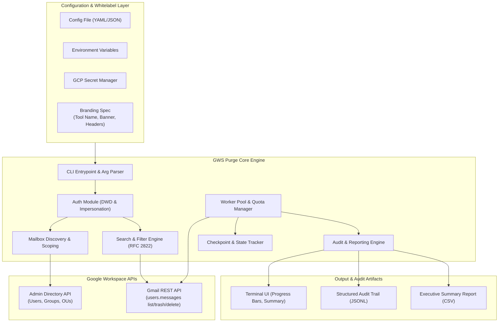
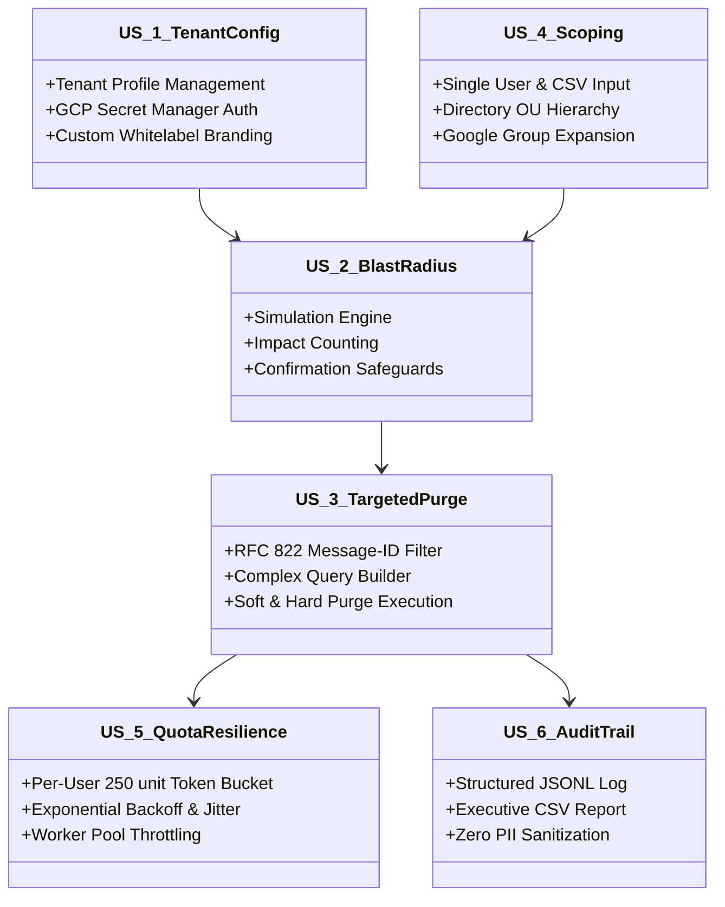
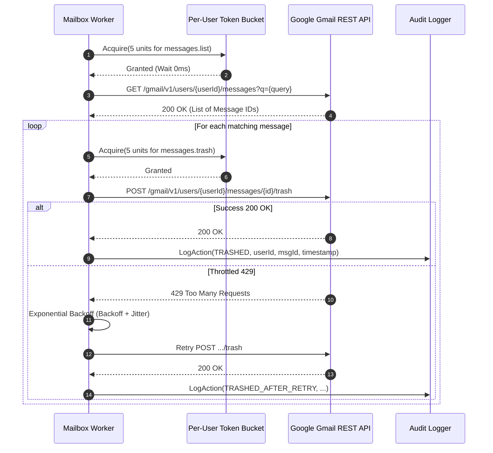

# Product Specification: Whitelabel Google Workspace Email Purge Tool

**Document ID:** DEV-PRD-GWS-PURGE-001  
**Version:** 1.0.0  
**Status:** Approved / Ready for Engineering  
**Author:** Devoteam G Cloud Product Team (@product-owner)  
**Stakeholders:** Devoteam Managed Services, Enterprise SecOps, Google Workspace Super Admins  
**Last Updated:** October 2026  

---

## 1. Executive Summary & Problem Statement

### 1.1 Business Context & Problem Statement
Enterprise organizations using Google Workspace (GWS) encounter severe operational and compliance crises requiring rapid, bulk email elimination:
- **Phishing & Malware Outbreaks:** Malicious emails bypass perimeter filters and reach hundreds or thousands of employee mailboxes. Security Operations (SecOps) teams must rapidly claw back these emails before users open them or click weaponized links.
- **Accidental Data Leakage & Spillages:** Confidential data, PII, intellectual property, or PHI sent to unintended internal mailing lists or individuals must be expunged immediately to prevent regulatory fines (GDPR, HIPAA, CCPA).
- **Compliance & Right-to-be-Forgotten:** Specific legacy communications or sensitive regulatory records must be systematically eliminated across organizational units or departed user mailboxes.

### 1.2 Current Challenges & Gaps
1. **Google Admin Console Limitations:** The native Email Investigation Tool is limited in scale, throttles large bulk queries, lacks granular multi-tenant scripting, and requires manual multi-step UI operations that introduce critical delays during active cyber incidents.
2. **Google Vault Complexities:** Google Vault is designed for archiving, eDiscovery, and legal holds—not rapid incident containment or surgical message purge.
3. **Third-Party SaaS Lock-in:** Existing third-party email clawback solutions demand exorbitant per-user/year recurring seat licenses, require continuous broad read-write mailbox permissions stored in external vendor clouds, and cannot be custom-branded by Managed Service Providers (MSPs).

### 1.3 Solution Vision
The **Whitelabel Google Workspace Email Purge Tool** (`gws-purge`) is an enterprise-grade, high-performance, white-label command-line tool and core automation engine. It leverages the Gmail API and Google Workspace Admin Directory API via Service Account Domain-Wide Delegation (DWD) to perform rapid, surgical, and auditable email purges across 1 to 100,000+ mailboxes. 

Engineered with Devoteam G Cloud's premier delivery standards, the tool is **100% white-label**, config-driven, secure, and vendor-neutral—enabling Devoteam engineers and client administrators to execute incident response operations under any client banner or internal brand.

### 1.4 Business Value & ROI
- **Reduced Mean Time to Remediate (MTTR):** Decreases phishing containment time from hours to minutes across entire enterprise domains.
- **Zero Seat Licensing:** Direct usage of standard Google Workspace and Google Cloud APIs eliminates third-party per-mailbox SaaS fees.
- **MSP Reusability:** Devoteam engineers can seamlessly switch between client profiles, Google Cloud Secret Manager vaults, and custom branding labels without modifying core code.
- **Zero False-Positive Risk:** Mandatory blast-radius analysis, dry-run simulation, and dual-custody safeguards prevent catastrophic data loss.

---

## 2. Target Personas

| Persona | Role | Core Goals | Key Pain Points |
| :--- | :--- | :--- | :--- |
| **Devoteam Managed Service Engineer** | Tier 3 GWS Support / Managed Cloud Operations | Execute rapid email containment across multiple client tenants without credential contamination or code alteration. | Context switching between tenants, lack of multi-tenant credential abstraction, risk of accidental cross-tenant execution. |
| **Enterprise GWS Super Admin** | Google Workspace Infrastructure Owner | Provide authorized incident response tools with strict guardrails, least-privilege scoping, and tamper-evident audit trails. | Native Admin Console search-and-purge is sluggish, awkward for large groups, and lacks scriptable blast-radius confirmation. |
| **SecOps / Incident Responder** | SOC Tier 2 / Tier 3 Analyst | Surgical message containment using RFC 822 Message-IDs, subjects, or sender queries with instant simulation and verification. | Inability to quickly verify how many inboxes were hit before triggering destructive deletion. |
| **Compliance & Privacy Officer (DPO)** | Corporate Governance & Legal Counsel | Ensure email purges comply with legal holds, generate non-repudiable audit logs, and adhere to zero-PII data logging standards. | Fear of unlogged hard deletions; risk of purge operations violating active litigation holds in Google Vault. |

---

## 3. Scope of Product

### 3.1 In-Scope
- Multi-tenant, config-driven white-label engine (YAML/JSON/ENV configuration).
- Domain-Wide Delegation (DWD) authentication with Service Account JSON keys or Google Cloud Secret Manager.
- Comprehensive Gmail RFC 2822 search query syntax parsing (`from:`, `to:`, `subject:`, `rfc822msgid:`, `after:`, `before:`, labels, complex boolean logic).
- Target mailbox scoping: Single user, CSV email list, Directory API Organizational Unit (OU) recursive scan, Google Group member expansion, and Domain-wide.
- Operational modes:
  - **Dry-Run (Simulation):** Discover matching messages, calculate blast radius (mailboxes, message IDs, thread IDs, dates), and output impact report without modifying mailboxes.
  - **Soft Purge (Trash):** Move matching messages to Trash (`users.messages.trash`), enabling a 30-day recovery window.
  - **Hard Purge (Permanent Delete):** Permanently expunge messages (`users.messages.delete`) bypassing Trash.
- Safety guardrails: Mandatory blast-radius confirmation prompt, `--force` override flag with configurable threshold limits, tokenized approval verification.
- Intelligent rate limiting and resilience: Dynamic per-user quota management (250 quota units/sec ceiling), global worker pool concurrency, exponential backoff with jitter on HTTP 429/500/503 errors.
- Job state checkpointing & resume: Ability to resume interrupted purge operations without duplicate processing.
- Tamper-evident structured audit logging (JSONL) and executive CSV summary generation (zero email body / attachment logging).

### 3.2 Out-of-Scope
- Modifying or clearing Google Vault retention holds or litigation holds (messages on hold will be retained in Vault according to GWS compliance rules even if purged from Gmail).
- Full email backup or export engine prior to deletion (organizations should utilize Google Vault or standard backup solutions).
- End-user self-service portal (tool is restricted to authorized Super Admins and SecOps engineers).
- Web-based GUI (v1.0 is strictly a production-ready, automatable CLI and reusable core Go/Python library).

---

## 4. Architecture & Whitelabel Design Principles



### 4.1 Whitelabel & Multi-Tenant Capabilities
1. **Configurable Identity & Branding:**
   - CLI banner, tool name, company name, contact URL, and log prefixes are configurable via `branding.yaml` or runtime configuration.
   - Default branding: Clean enterprise Devoteam G Cloud banner.
   - Customizable to any enterprise client name (e.g., "Acme Corp Incident Containment Utility").
2. **Tenant Isolation:**
   - Multi-tenant profile switching (e.g., `--profile client-alpha`, `--profile client-bravo`).
   - Profile definitions isolate:
     - `tenant_id` & `domain`
     - Service account credentials (local file path or GCP Secret Manager secret resource URI `projects/*/secrets/*/versions/*`)
     - Default delegator admin subject email
     - Custom output directories for logs and reports
3. **Zero Vendor Lock-In:**
   - Standalone execution; no third-party cloud brokers or external telemetry endpoints.
   - All credentials and logs remain strictly within the operator's Google Cloud project and target Google Workspace environment.

---

## 5. Functional Requirements (FR)

### FR-1: Search Query & RFC 2822 Support
- **FR-1.1:** The tool MUST accept standard Gmail search queries as defined by RFC 2822 and Gmail API search syntax, including:
  - `from:`, `to:`, `cc:`, `bcc:`
  - `subject:` (with phrase match support `"..."`)
  - `rfc822msgid:` (exact internet Message-ID match, e.g., `<abc-123@sender.com>`)
  - `after:YYYY/MM/DD`, `before:YYYY/MM/DD`, `older_than:`, `newer_than:`
  - `has:attachment`, `filename:`
  - Complex boolean logic (`AND`, `OR`, `NOT`, `{"..."}`)
- **FR-1.2:** The tool MUST validate query syntax prior to execution to prevent malformed API requests.
- **FR-1.3:** For incident containment, the tool MUST provide dedicated fast-flags for `--message-id`, `--sender`, `--subject`, and `--received-after` that auto-compose into a strict Gmail query.

### FR-2: Target Mailbox Scoping & Resolution
- **FR-2.1:** The tool MUST support multiple target mailbox ingestion modes:
  - **Single Mailbox:** `--user user@domain.com`
  - **List/CSV Input:** `--file-list /path/to/mailboxes.csv` or `.txt` (one email per line or CSV column `email`)
  - **Organizational Unit (OU):** `--org-unit "/Security/Engineering"` (queries Directory API `users.list` filtering by `orgUnitPath`, supporting `--recursive` flag)
  - **Google Group:** `--group incident-responders@domain.com` (resolves all member email addresses via Directory API `members.list`)
  - **Domain-Wide:** `--all-domain-users` (fetches all active user mailboxes across the primary and secondary domains via Directory API)
- **FR-2.2:** The tool MUST deduplicate mailboxes and exclude suspended or archived accounts unless explicitly overridden with `--include-suspended`.

### FR-3: Purge Operations & Execution Modes
- **FR-3.1 Dry-Run Mode (Simulation):**
  - Enabled via `--dry-run` or as default when no purge action is explicitly confirmed.
  - Queries target mailboxes via `users.messages.list` matching the search query.
  - Fetches message metadata (`users.messages.get` with `format=METADATA` and metadata headers `Message-ID, Subject, From, Date`).
  - Does NOT call `trash` or `delete`.
  - Calculates and outputs the Blast Radius Summary:
    - Total mailboxes scanned vs mailboxes matched.
    - Total matching messages count and thread count.
    - Earliest and latest message timestamps found.
- **FR-3.2 Soft-Purge Mode (Trash):**
  - Invoked with `--action trash` or `--soft-purge`.
  - Moves matching messages to the user's Gmail Trash folder via `users.messages.trash`.
  - Messages remain recoverable by the user or admin for 30 days before automated deletion.
- **FR-3.3 Hard-Purge Mode (Permanent Delete):**
  - Invoked with `--action delete` or `--hard-purge`.
  - Permanently purges messages via `users.messages.delete`.
  - Bypasses Trash; non-recoverable via standard Gmail interface (subject to Google Vault retention if configured).
- **FR-3.4 Google Vault Awareness:**
  - The tool documentation and execution logs MUST clearly notify the operator that Google Vault retention rules and legal holds will continue to preserve messages in Vault for eDiscovery, even if hard-purged from the user's active mailbox.

### FR-4: Safety Guardrails & Blast Radius Controls
- **FR-4.1 Blast Radius Display:**
  - Before executing any destructive action (trash or delete), the tool MUST print an interactive confirmation card displaying:
    - Target Query
    - Scoped Mailbox Count
    - Total Matched Messages
    - Action Type (`SOFT PURGE [TRASH]` or `HARD PURGE [PERMANENT DELETE]`)
- **FR-4.2 Confirmation Prompt:**
  - An interactive terminal session MUST require the operator to type `CONFIRM` or the exact purge action name.
- **FR-4.3 Automation Safeguards (`--force` & Safeguard Thresholds):**
  - For headless/CI/CD execution, a `--force` flag is required to bypass interactive confirmation.
  - A configurable blast radius threshold (`--max-impact-threshold <N>`, default: 500 messages) MUST abort execution if total matched messages exceed the threshold, requiring an explicit `--override-threshold` parameter.
- **FR-4.4 Wildcard & Empty Query Rejection:**
  - Queries evaluating to empty string, `*`, or universally matching filters without constraints MUST be rejected immediately with an error to prevent accidental wipeout.

### FR-5: Resilience, Rate Limiting & Quota Management
- **FR-5.1 Quota Budgeting:**
  - Gmail API enforces a limit of 250 quota units per user per second.
    - `messages.list`: 5 units
    - `messages.get`: 5 units
    - `messages.trash`: 5 units
    - `messages.delete`: 50 units
  - The tool MUST employ a token bucket or leaky bucket rate limiter per user thread to never exceed 200 units/second per mailbox (80% safety margin).
- **FR-5.2 Adaptive Worker Pool:**
  - Configurable worker concurrency (`--concurrency <N>`, default: 10, max: 50).
  - Workers process distinct mailboxes concurrently to maximize domain-wide throughput while maintaining per-user safety.
- **FR-5.3 Exponential Backoff with Jitter:**
  - Upon receiving HTTP 429 (Too Many Requests), 500, or 503 (Service Unavailable), the tool MUST retry up to 5 times using exponential backoff with full jitter ($t = \min(M, B \times 2^{\text{attempt}}) \times \text{rand}(0.5, 1.5)$).

### FR-6: Resumable Execution & State Checkpointing
- **FR-6.1 Checkpoint File:**
  - The tool MUST maintain an atomic append-only checkpoint file (`.gws_purge_checkpoint_<job_id>.jsonl`).
  - Records mailbox status: `PENDING`, `IN_PROGRESS`, `COMPLETED`, `FAILED`.
- **FR-6.2 Resume Capability:**
  - If a job is halted (e.g., network disconnect, process termination, SIGINT), running the command with `--resume <job_id>` MUST skip already completed mailboxes and resume pending ones seamlessly.

### FR-7: Audit Trail & Reporting
- **FR-7.1 Structured JSONL Audit Trail:**
  - Every evaluated message and purge action MUST be recorded in a tamper-evident `.jsonl` audit log file.
  - Log entries MUST include:
    - `timestamp_utc`
    - `job_id`
    - `tenant_id`
    - `operator_user`
    - `target_mailbox`
    - `message_id` (Gmail internal ID)
    - `rfc822_message_id` (Header Message-ID)
    - `subject` (sanitized or hashed if configured)
    - `sender`
    - `received_timestamp`
    - `action_taken` (`SIMULATED`, `TRASHED`, `DELETED`, `SKIPPED`, `ERROR`)
    - `api_response_status`
- **FR-7.2 Zero PII / Body Logging:**
  - The tool MUST NEVER log email body content, snippets, or file attachments to audit logs or console output under any circumstances.
- **FR-7.3 Executive CSV Report:**
  - Upon completion, the tool MUST generate an executive summary CSV detailing:
    - User Email, Search Query, Status, Messages Matched, Messages Purged, Error Message (if any).

---

## 6. Non-Functional Requirements (NFR)

### NFR-1: Security & Compliance
- **Least-Privilege API Scopes:**
  - Read-only / Dry-run operations: `https://www.googleapis.com/auth/gmail.readonly`, `https://www.googleapis.com/auth/admin.directory.user.readonly`, `https://www.googleapis.com/auth/admin.directory.group.readonly`.
  - Soft purge: `https://www.googleapis.com/auth/gmail.modify`.
  - Hard purge: `https://mail.google.com/`.
- **Credential Protection:**
  - Support for GCP Secret Manager to eliminate plain-text service account keys on operator disks.
  - Temporary memory storage of credentials; zero persistence in temporary directories.
- **Compliance:**
  - Meets SOC 2 Type II, ISO 27001, and GDPR Article 32 guidelines for audited data processing.

### NFR-2: Performance & Scalability
- **Throughput:**
  - Process at least 25-50 mailboxes per minute per 10 worker threads.
  - For a 5,000-user organization, a targeted single Message-ID scan and purge MUST complete within 15-20 minutes under standard quota allocations.
- **Resource Footprint:**
  - Lightweight memory usage (< 256MB RAM) using streaming iterators and paginated API responses (`maxResults=100`).

### NFR-3: Reliability & Fault Tolerance
- **Isolation of Failures:**
  - A failure on one mailbox (e.g., account suspended, mailbox not found, temporary backend error) MUST NOT crash the process or abort processing of subsequent mailboxes.
  - Failed mailboxes MUST be recorded in the error log for discrete retry.
- **Signal Handling:**
  - Graceful trap of `SIGINT` (Ctrl+C) and `SIGTERM`, flushing pending audit logs and closing checkpoint state safely.

### NFR-4: Usability & Operator Experience
- **Interactive Terminal UI:**
  - Clean CLI outputs with live multi-bar progress (overall job progress and active worker status).
  - Headless/Quiet mode (`--quiet`) for scripting in automated SOAR / CI workflows.
  - Clear, human-readable error messages with suggested remediation (e.g., "DWD permission not granted for scope X").

---

## 7. Agile Backlog & BDD User Stories



### US-1: Tenant & Whitelabel Profile Configuration
**As a** Devoteam Managed Service Engineer  
**I want to** specify tenant-specific profiles with externalized Google Cloud service account credentials and custom branding  
**So that** I can securely execute email purges across multiple customer environments under their designated brand identity without credential leakage.

#### Acceptance Criteria (BDD):
- **Scenario 1.1: Load configuration from GCP Secret Manager**
  - **Given** a valid configuration profile `profiles.yaml` pointing to a Secret Manager secret `projects/msp-core/secrets/client-alpha-sa/versions/latest`
  - **And** the operator possesses the `roles/secretmanager.secretAccessor` role
  - **When** the operator runs `gws-purge --profile client-alpha --dry-run --query "subject:phishing"`
  - **Then** the tool authenticates via DWD impersonating the profile's delegator admin
  - **And** displays the custom tenant banner configured in `branding.yaml`
  - **And** does not write credentials to disk.

- **Scenario 1.2: Missing or invalid DWD credentials**
  - **Given** a tenant profile with an invalid private key or missing DWD authorization in the Google Workspace Admin Console
  - **When** the operator initiates an execution
  - **Then** the tool halts before scanning any mailboxes
  - **And** outputs a clear error explaining the authorization failure and required OAuth scopes.

---

### US-2: Dry-Run Mode & Blast-Radius Calculation
**As an** Enterprise SecOps Analyst  
**I want to** execute a dry-run simulation of an email purge query across scoped mailboxes  
**So that** I can accurately assess the blast radius (number of users and messages affected) and prevent accidental mass deletions.

#### Acceptance Criteria (BDD):
- **Scenario 2.1: Dry-run simulation produces blast radius summary**
  - **Given** a search query `subject:"Urgent Payment Required"` and a target CSV with 500 employee mailboxes
  - **When** the operator runs the tool with the `--dry-run` flag
  - **Then** the tool inspects all 500 mailboxes using read-only API calls
  - **And** calculates that 42 matching messages exist across 38 mailboxes
  - **And** prints a Blast Radius Summary table showing mailboxes matched, message IDs, and timestamps
  - **And** ensures zero messages are moved to Trash or permanently deleted.

- **Scenario 2.2: Mandatory confirmation for destructive actions**
  - **Given** a dry-run has identified 42 matching messages
  - **When** the operator runs the command without `--dry-run` and specifies `--action trash`
  - **Then** the tool pauses and displays an interactive prompt: `Type 'CONFIRM' to purge 42 messages across 38 mailboxes:`
  - **And** terminates cleanly without modifying messages if the operator enters anything other than `CONFIRM`.

---

### US-3: Targeted Incident Response (Message-ID & Query Purge)
**As an** Incident Response Lead  
**I want to** surgically purge a phishing message using its exact RFC 822 Message-ID or compound query  
**So that** malicious emails are contained instantly across all affected mailboxes.

#### Acceptance Criteria (BDD):
- **Scenario 3.1: Surgical purge via RFC 822 Message-ID**
  - **Given** a phishing email with Message-ID `<20261002.12345.alert@malicious-sender.com>`
  - **When** the operator runs `gws-purge --message-id "<20261002.12345.alert@malicious-sender.com>" --action trash --confirm`
  - **Then** the tool queries mailboxes using `rfc822msgid:<20261002.12345.alert@malicious-sender.com>`
  - **And** invokes `users.messages.trash` on every matching message
  - **And** confirms all targeted instances are placed into Trash.

- **Scenario 3.2: Permanent delete execution (Hard Purge)**
  - **Given** a severe data spill containing sensitive regulatory data requiring immediate hard destruction
  - **When** the operator executes `gws-purge --query "subject:'Confidential Payroll 2026'" --action delete --confirm --token "TOKEN-SEC-998"`
  - **Then** the tool invokes `users.messages.delete` for all matching messages
  - **And** records each permanent deletion in the audit log with the authorization token.

---

### US-4: Scoped Mailbox Ingestion (CSV, Org Unit, Group)
**As a** Google Workspace Super Admin  
**I want to** scope the email purge to a specific Organizational Unit, Google Group, or custom CSV list  
**So that** I can restrict purge operations precisely to the affected user population.

#### Acceptance Criteria (BDD):
- **Scenario 4.1: Scoping via Organizational Unit**
  - **Given** a company structure with OU `/Finance/Accounts Payable` containing 45 users
  - **When** the operator executes `gws-purge --org-unit "/Finance/Accounts Payable" --query "from:fraud@badactor.com" --dry-run`
  - **Then** the tool queries the Directory API to enumerate all active users under that OU path
  - **And** executes the query only against those 45 resolved mailboxes.

- **Scenario 4.2: Scoping via Google Group expansion**
  - **Given** a Google Group `all-contractors@domain.com` with 120 direct and nested members
  - **When** the operator executes `gws-purge --group all-contractors@domain.com --query "subject:Malware" --dry-run`
  - **Then** the tool expands group membership, deduplicates email addresses, and scans only those mailboxes.

---

### US-5: Rate Limiting & Quota Throttling Resilience
**As a** Cloud Systems Engineer  
**I want** the purge engine to strictly enforce per-user rate limits and handle API backoff  
**So that** the tool never causes Gmail API service outages or rate-limit lockouts during large-scale operations.

#### Acceptance Criteria (BDD):
- **Scenario 5.1: Enforcement of 250 quota units/sec ceiling**
  - **Given** an aggressive multi-threaded purge running against a busy user mailbox with 100 matching messages
  - **When** the worker initiates batch trash operations
  - **Then** the internal token-bucket limiter restricts API calls for that user to $\le 200$ quota units per second
  - **And** prevents HTTP 429 quota exhaustion.

- **Scenario 5.2: Handling transient 429 / 503 API responses**
  - **Given** the Google API returns HTTP 429 or 503 for a specific user request
  - **When** the error is caught by the worker
  - **Then** the worker triggers an exponential backoff retry with jitter up to 5 attempts
  - **And** logs the retry event without halting the overall batch operation.

---

### US-6: Immutable Audit Trail & Executive Reporting
**As a** Compliance & SecOps Officer  
**I want** a structured, tamper-evident audit log and an executive CSV report generated for every purge run  
**So that** our organization maintains non-repudiable proof of action for regulators without storing any email body content.

#### Acceptance Criteria (BDD):
- **Scenario 6.1: JSONL audit log generation without PII**
  - **Given** a completed purge job affecting 300 messages across 25 mailboxes
  - **When** the audit log file `audit_purge_<job_id>.jsonl` is inspected
  - **Then** each record contains `timestamp_utc`, `operator`, `mailbox`, `message_id`, `rfc822_id`, `sender`, and `action_taken`
  - **And** does NOT contain the email body, snippet, or attachments.

- **Scenario 6.2: Executive CSV summary export**
  - **Given** a finished purge execution
  - **When** the process concludes
  - **Then** a CSV file `report_purge_<job_id>.csv` is written to the output directory
  - **And** provides aggregated totals of mailboxes scanned, messages matched, messages purged, and execution duration.

---

## 8. CLI Interface & Operational UX Specification

### 8.1 Command Structure
```bash
# General syntax
gws-purge [COMMAND] [FLAGS]

# Commands:
#   scan      Perform search and calculate blast radius (Dry-run by default)
#   trash     Move matching messages to Gmail Trash (Soft purge)
#   delete    Permanently purge matching messages (Hard purge)
#   resume    Resume an interrupted execution job via checkpoint
#   version   Display tool version and tenant branding info
```

### 8.2 Key Flag Reference

| Flag | Short | Description | Default |
| :--- | :--- | :--- | :--- |
| `--profile` | `-p` | Configuration profile name in `profiles.yaml` | `default` |
| `--query` | `-q` | Full Gmail search query string (RFC 2822) | None (Required if no fast flag) |
| `--message-id` | `-m` | Exact RFC 822 Message-ID (wraps into `rfc822msgid:...`) | None |
| `--user` | `-u` | Single target mailbox email address | None |
| `--file-list` | `-f` | Path to CSV/text file containing list of target mailboxes | None |
| `--org-unit` | `-o` | Organizational Unit path to scan (e.g. `"/Staff/HQ"`) | None |
| `--group` | `-g` | Google Group email to expand members from | None |
| `--all-domain` | | Target all domain user accounts | `false` |
| `--dry-run` | `-d` | Simulate search and output blast radius without changes | `true` |
| `--force` | | Bypass interactive confirmation prompt | `false` |
| `--max-threshold` | | Abort if matched messages exceed this number without override | `500` |
| `--concurrency` | `-c` | Number of concurrent mailbox worker threads | `10` |
| `--output-dir` | | Directory for audit JSONL, CSV reports, and checkpoints | `./reports` |
| `--resume` | `-r` | Job ID to resume from existing checkpoint file | None |

### 8.3 Terminal Output Example (Mockup)
```text
================================================================================
  DEVOTEAM G CLOUD | Enterprise Email Incident Containment Tool
  Tenant: Devoteam Internal Security Operations (Production)
================================================================================
[*] Loaded Profile: prod-eu-west1 (Credentials: GCP Secret Manager)
[*] Authenticated as Super Admin: security-admin@client-domain.com
[*] Target Scope: Group "all-employees@client-domain.com" (Resolved: 1,420 mailboxes)
[*] Search Filter: rfc822msgid:<20261002.phish@fakebank-security.com>

>>> SCANNING MAILBOXES (Dry-Run Simulation)...
Progress: [████████████████████████████████████████] 100% (1,420/1,420 mailboxes)

--------------------------------------------------------------------------------
BLAST RADIUS ASSESSMENT
--------------------------------------------------------------------------------
Total Mailboxes Scanned : 1,420
Mailboxes With Matches  : 84
Total Messages Found    : 84
Total Threads Affected  : 84
Earliest Message Date   : 2026-10-02 06:14:22 UTC
Latest Message Date     : 2026-10-02 06:18:45 UTC
Target Action           : SOFT PURGE [MOVE TO TRASH]
--------------------------------------------------------------------------------

[!] ACTION REQUIRED: You are about to TRASH 84 messages across 84 mailboxes.
Type 'CONFIRM' to proceed with purge, or Ctrl+C to abort: CONFIRM

>>> EXECUTING SOFT PURGE...
Progress: [████████████████████████████████████████] 100% (84/84 purged)

[✓] PURGE OPERATION COMPLETED SUCCESSFULLY.
    - Successfully Trashed: 84
    - Failed / Errors: 0
    - Structured Audit Log: ./reports/audit_purge_20261002_071128.jsonl
    - Executive CSV Report: ./reports/report_purge_20261002_071128.csv
================================================================================
```

---

## 9. Technical Architecture & Component Specifications

### 9.1 Authentication & DWD Handshake
1. The tool authenticates against Google OAuth2 token endpoints (`https://oauth2.googleapis.com/token`) using a Google Cloud Service Account with private key JWT signing.
2. Performs subject impersonation using the delegated administrator email (`sub: admin@customer-domain.com`).
3. Requests minimum required OAuth scopes based on the invoked command:
   - For `scan` / `--dry-run`: Read-only scopes.
   - For `trash`: `gmail.modify`.
   - For `delete`: `https://mail.google.com/`.

### 9.2 Rate Limiter & Concurrency Architecture


---

## 10. Acceptance Test & Compliance Checklist

| Category | Verification Item | Standard | Status |
| :--- | :--- | :--- | :--- |
| **Safety** | Dry-run is enforced by default if no action flag is supplied | No write API calls allowed in default invocation | **MANDATORY** |
| **Safety** | Interactive confirmation is required for all trash/delete operations | Must type exact confirmation token or string | **MANDATORY** |
| **Safety** | Empty query or single-character wildcard is blocked | Immediate pre-flight rejection with exit code 1 | **MANDATORY** |
| **Security** | Zero PII / zero message body retention in logs | Strict audit schema enforcement; tests verify no body data | **MANDATORY** |
| **Security** | Secret Manager credential resolution verified | Support secret URI without saving key file to disk | **MANDATORY** |
| **Reliability** | Job interruption recovery via checkpoint file | State checkpoint test: kill process, resume, zero re-purges | **MANDATORY** |
| **Reliability** | Quota error handling (429/503) retry with jitter | Mock test verifying exponential backoff with full jitter | **MANDATORY** |
| **Compliance** | Google Vault retention disclaimer displayed | Clear warning that Vault retention rules override active purge | **MANDATORY** |

---

## 11. Appendix: API Scopes & Quota Reference

### 11.1 Google Workspace OAuth Scopes Matrix

| Purpose | Scope URI | Access Level |
| :--- | :--- | :--- |
| **Directory User Resolution** | `https://www.googleapis.com/auth/admin.directory.user.readonly` | Read-only |
| **Directory Group Resolution** | `https://www.googleapis.com/auth/admin.directory.group.readonly` | Read-only |
| **Dry-Run & Message Scan** | `https://www.googleapis.com/auth/gmail.readonly` | Read-only |
| **Soft Purge (Trash)** | `https://www.googleapis.com/auth/gmail.modify` | Read/Write (Move to trash) |
| **Hard Purge (Permanent Delete)** | `https://mail.google.com/` | Full Mailbox Access (Permanent expunge) |

### 11.2 Gmail API Quota Cost per Method

| Method | HTTP Path | Quota Units |
| :--- | :--- | :--- |
| `users.messages.list` | `GET /gmail/v1/users/{userId}/messages` | 5 |
| `users.messages.get` | `GET /gmail/v1/users/{userId}/messages/{id}` | 5 |
| `users.messages.trash` | `POST /gmail/v1/users/{userId}/messages/{id}/trash` | 5 |
| `users.messages.delete` | `DELETE /gmail/v1/users/{userId}/messages/{id}` | 50 |
| `users.messages.batchDelete` | `POST /gmail/v1/users/{userId}/messages/batchDelete` | 50 |
